# 1342: 108資料結構作業 - Binary Search Tree

* Time Limit: 1 Sec
* Memory Limit: 128 MB
* Submit: 2
* Solved: 2

## Description

``` content
Suppose that each node containing a keyvalue (int) and link in a binary search tree also has the field LeftSize as described in the text. Please write a class BinaryTree to implement the following functions:

(1)  insertNode() to insert a node into a binary search tree.

(2)  deleteNode() to delete a node(delete by value)from the binary search tree.(If there are two child, replace the delete node with the smallest key in the right sub tree.)

(3)  searchByValue() to search a node by value, if it exists, show the LeftSize and Depth of the node.

(4)  searchByRank() to search a node by rank K(the Kth smallest).

(5)  showInorder() to print out the inorder traversal of the nodes’ values.

(6)  showPreorder() to print out the preorder traversal of the nodes’ values.

(7)  showPostorder() to print out the postorder traversal of the nodes’ values.

and interact with the user by the corresponding command: function# keyvalue, where function# is valid from 1 to 7, and keyvalue is the value of nodes in the binary tree.

 

Note :
If you insert duplicate data, output : ”Duplicate data.”
If there’s no such value to delete, output : “No such value to delete.”

If there’s no such value to search, output : “No such value.”
```

## Input

``` content
See the Sample Input.
```

## Output

``` content
See the Sample Output.
```

## Sample Input

``` content
1 50
1 23
1 71
1 12
1 34
1 14
1 29
1 37
1 24
1 23
2 23
2 23
3 24
3 11
4 6
4 12
5
6
7
```

## Sample Output

``` content
[INSERT SUCCESS]
[INSERT SUCCESS]
[INSERT SUCCESS]
[INSERT SUCCESS]
[INSERT SUCCESS]
[INSERT SUCCESS]
[INSERT SUCCESS]
[INSERT SUCCESS]
[INSERT SUCCESS]
Duplicate data.
[DELETE SUCCESS]
No such value to delete.
LeftSize = 3, Depth = 2
No such value.
The 6th smallest is 37
No such value.
12 14 24 29 34 37 50 71 
50 24 12 14 34 29 37 71 
14 12 29 37 34 24 71 50 
```

---

