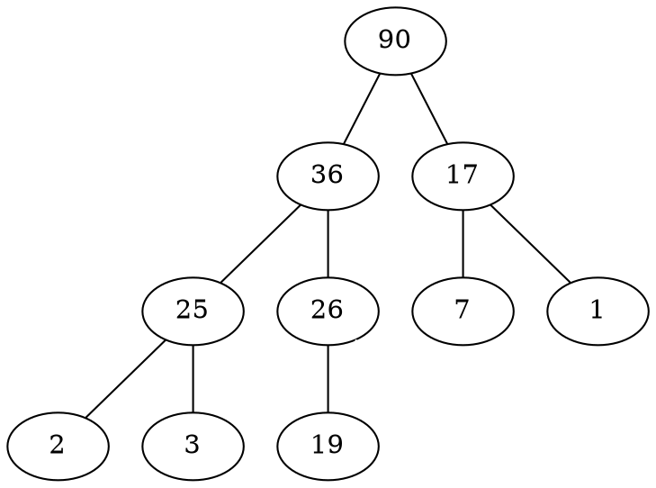
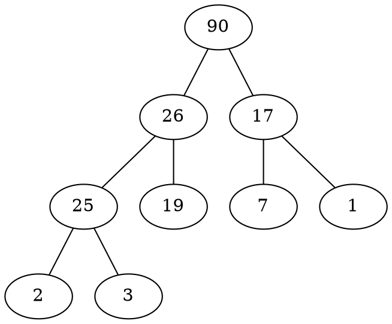
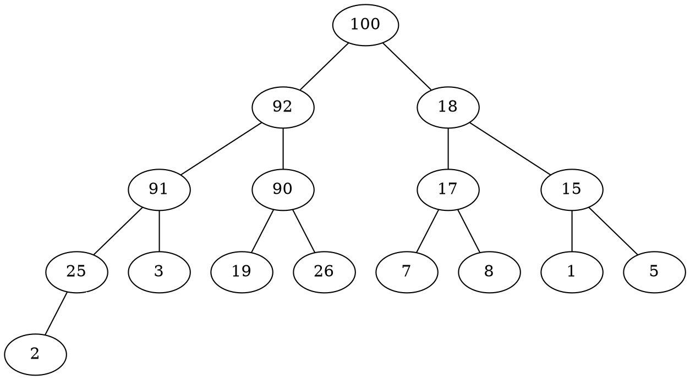
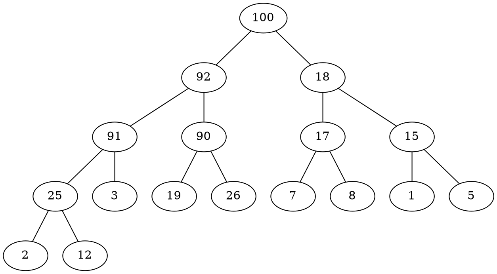

# 1355: 108資料結構期中考 - Binary Max Heap

* Time Limit: 1 Sec
* Memory Limit: 128 MB

## Description

``` markdown
Design a binary max heap.

To be specific, your design should include the following commands.

* Insert value: Given an integer or an integer array, insert it into the heap. Ensure a max heap after the insertion.
* Delete value: Given an integer or an integer array, delete the element in the heap. If the heap is empty, you must print `The heap is empty.`. If the element is not in the heap, you must print `Value XX is not in the heap.`.
* Print: Print the binary max heap.
* Exit: Exit the program.

Note:

* The inserting array's size is at least 1000.
* The inserting value can be duplicated.
* If there are duplicate values, the deletion order of nodes containing the value is to delete the node with highest depth first. In case, those nodes are at the same level, the rightmost node is deleted first.
* Here is an deletion order example:
```


## Input

``` markdown
See the Sample Input.
```

## Output

``` markdown
See the Sample Output.
```

## Sample Input

``` markdown
Delete 36
Insert 2 7 26 25 19 17 1 90 3 36
Delete 5
Print
Delete 36
Print
Insert 100 91 18 8 5 15 92
Print
Insert 12
Print
Exit
```

## Sample Output

``` markdown
The heap is empty.
Value 5 is not in the heap.
90 36 17 25 26 7 1 2 3 19
90 26 17 25 19 7 1 2 3
100 92 18 91 90 17 15 25 3 19 26 7 8 1 5 2
100 92 18 91 90 17 15 25 3 19 26 7 8 1 5 2 12
```

## sample tree







